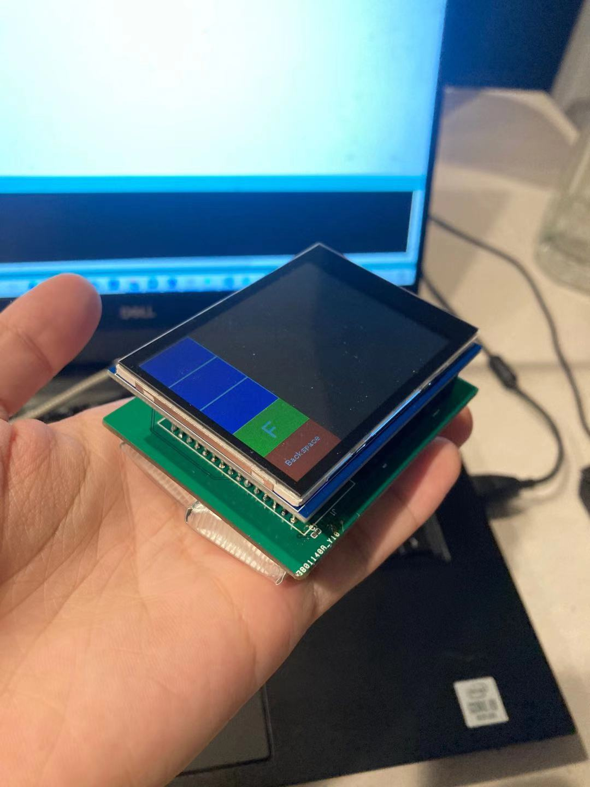

# Main Page
# BLE-enabled HID based on Edge Inference Accelerated Handwriting Recognition
# Abstract

In this project, we build a low-cost, small-size and low-power real-time handwritten character recognition system based on Arduino Nano 33 BLE Sense with a touch screen, which is capable of offering fluent handwriting input experience in real-time and send recognized characters to BLE-enabled terminal equipment as keyboard strokes. Inference of character recognition deep learning model is done on the Arduino Nano 33 BLE Sense to enable the compatibility to any BLE-enabled devices. We achieve a accuracy of 80.6% in fast mode with a latency of 200ms and 95.4% in slow mode. In addition, we designed the PCB and 3D printed case for the device to reduce the use of flying wires and to make the device integrated and portable.

    

# Team

* Name of team member \#1 Yu Nong
* Name of team member \#2 Hanlong Chen

# Required Submissions

* [Proposal](proposal)
* [Midterm Checkpoint Presentation Slides](https://github.com/hlc1209/ecem202a_project/blob/main/docs/M202A%20Midterm%20Presentation.pptx)
* [Final Presentation Slides](https://github.com/hlc1209/ecem202a_project/blob/main/docs/M202A%20Final%20Presentation.pptx)
* [Final Report](report)

# Highlights

<iframe width="80%" height="300"
src="https://www.youtube.com/embed/TnqZWla2pq8" 
frameborder="0" 
allow="accelerometer; encrypted-media; picture-in-picture" 
allowfullscreen></iframe>

* [Demo Video for Fast Mode](https://github.com/hlc1209/ecem202a_project/raw/main/docs/media/fast_demo.mp4)

<iframe width="80%" height="300"
src="https://www.youtube.com/embed/La2jUmT9tKs" 
frameborder="0" 
allow="accelerometer; encrypted-media; picture-in-picture" 
allowfullscreen></iframe>

* [Demo Video for Slow Mode](https://github.com/hlc1209/ecem202a_project/raw/main/docs/media/slow_demo.mp4)