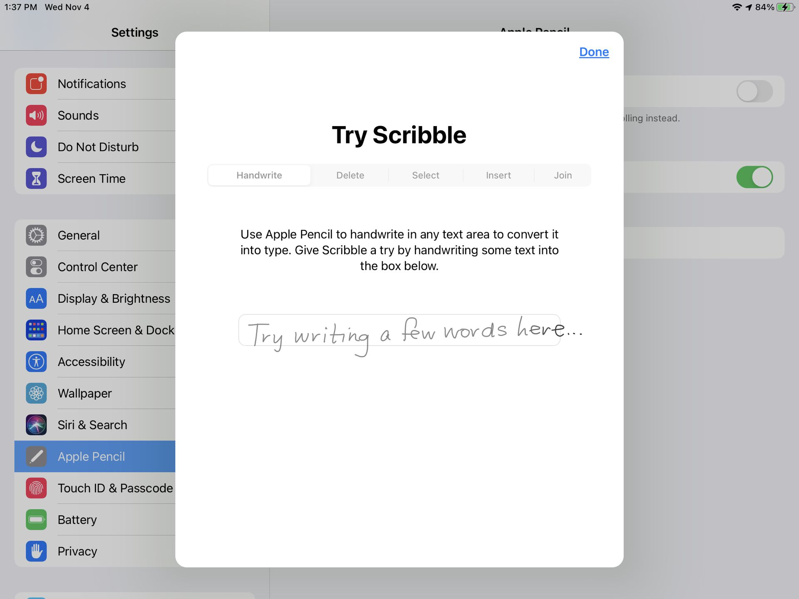

# Proposal
# 1. Motivation & Objective

Designers have long recognized that handwriting with a pen offers more fluidity compared with typing. After the keyboard has been the dominant input device for electronics for years, stylus pen comes into play as another commonly-used input device for electronics. While stylus pen becomes increasingly popular over the years, problems remain in this type of device, which could be turned into sizable market if properly solved. 

First, the cost of handwritten-enabled devices with a smooth experience is high. Currently, multiple solutions exist for scribble digitization. For example, Microsoft Surface Pro has a built-in Wacom-made digitizer layer and a pen designed for it to achieve such functionality. Apple iPad introduced the scribble feature in iOS 14 with an extremely enhanced seamless handwriting input experience, but it requires the powerful computing power of the A14 chip and a separately sold apple pencil. Other solutions like capacitive and bluetooth stylus have readily lower cost. Still, they can only work with devices with touchscreen enabled and rely on hardware-specific optimized software to deliver a good experience. It is undeniably true that the vast majority of low-end devices offer a very poor handwriting experience.

Secondly, hardware support is relatively stringent. Most of the handwritten solutions for electronics does not generalize well to different devices and mainly focus on the need of high-end electronics. Also, if handwritten characters are used as input, the recognition of handwritten characters becomes the burden on the interfaced device, placing demands on the system's software and hardware performance, increasing the system's complexity and reducing its reliability and real-time performance.

To tackle the aforementioned problems, we propose to develop a low-cost and low-power device with a capacitive touchscreen that is able to offers a fluent handwriting input experience and send commands/keyboard strokes to bluetooth low energy (BLE) enabled devices as an alternative to conventional keyboard input. Such device is essentially a new type of human interface devices (HID) and able to work universally with any BLE enabled devices with minimum change in firmware. Since the handwritten recognition is done on this embedded device, there would be little hardware constraints for the interfaced devices except BLE capability. 

# 2. State of the Art & Its Limitations

In 2018, Fernández et. al developed a real-time handwritten letter recognition system based on Raspberry Pi 3 using ConvNets which is able to achieve an accuracy of 93.4% and an average response time of 21.9 ms. This is the best performance of all similar systems that run the machine learning model offline considering accuracy, response, power consumption, and size. 

However, limitations remain on this system. First, the machine learning used in this system is still too large for the microcontroller. Also the model could be further compressed with proper pruning, quantization, and other model compression techniques. Second, by replacing the Raspberry Pi 3 with a low-power microcontroller (i.e., the Arduino Nano 33 BLE Sense in our case), the power consumption and size of the system can be further reduced. Finally and most importantly, this article only demonstrates the feasibility of individual character recognition using deep learning networks in embedded systems, and does not illustrate the performance of handwriting recognition in real-world applications when coupled with peripherals, such as touch screen and BLE-enabled terminals. 

In 2019, Google Research uses recurrent neural network to enable seamless handwriting input on Android devices. Unlike traditional hand-designed heuristics to cut the handwritten input into single characters, Google build an RNN model that operates on the whole input. They convert a series of handwritten inputs into a sequence of Bessel curves that are fed into the RNN to get the actual written characters.

Nevertheless, this powerful approach relies on strong chips on Android devices and even requires specially designed chips like Google Tensor with TPU cores to deliver smooth interactions, which is unacceptable in our project.

# 3. Novelty & Rationale

Nowadays, handwritten recognition solutions either work on specialized devices or touchscreen enabled high-end electronics, e.g., BMW iDrive infotainment system and Apple iPad. Also, the handwritten recognition algorithm of these devices typical requires the support of powerful processors. We envision a system with a small touch screen built in to collect handwritten inputs and infer the written characters on chip before sending out the commands/keyboard strokes. 

Therefore, high compatibility and fluent input experience on a low-cost, low-power compact device is the main aspect that makes our proposed device stand out from other touchscreen solutions available in the market. 

Moreover, given the flexibility of handwritten input, the device has unlimited possibilities for extended functionality. For example, performing calculations on handwritten numbers and symbols and transmitting the final results to the terminal equipment via BLE.

# 4. Potential Impact

If successfully made, this device could become a new type of human interface device that is compatible to any BLE enable devices not limited to high-end electronics like laptops and tablets. For instance, it could be used to recognize and convert user's writings to keyboard strokes to replace the functionality of a keyboard upon user's desire. Similarly, it could also become an input device of speech-synthesizer for speech impaired people. 

In short, such device brings a new way of electronic interface with high performance, great compatibility and low cost. 

# 5. Challenges

First of all, the experience of handwriting recognition input is critical, i.e., low latency, high accuracy and high efficiency. After we decided to use on-device deep learning inference for handwriting character recognition, it became pivotal to implement fast and accurate model inference while handling GUI drawing, user stroke input and BLE transmission on an ultra-low power device. Secondly, how to achieve fluent handwriting input on ultra-low power devices is to be overcome. We need a deep collaboration of deep learning models and GUI to achieve this. Likewise, data transmission via BLE is very important and needs to be user friendly, low latency and highly reliable. 

# 6. Requirement for Success

To build such a system, the following skill sets and resources are needed.

## Skill sets
* Embedded system
* Real-time operating system
* Bluetooth Low Energy (BLE)
* SPI and I2C
* Electronics
* Machine Learning and model compression

## Skill sets potentially in need
* PCB design
* Mechanical Design

## Hardware
* Arduino Nano 33 BLE Sense
* Adafruit 2.8" TFT Touch Shield v2 (capacitive touch)
* Breadboard

## Hardware potentially in need
* Boost converter
* 3d Printer

# 7. Metrics of Success

The success of the project will be evaluated through the following metrics. 

1. Accuracy:
   The success rate of recognizing written characters.

2. Response time:
   The time from finishing writing a character to the completion of transmission.

3. Fluentness: 
   The time to write a series of characters.

4. Power consumption:
   The power consumption of the entire system.

5. Size & Weight:
   The size and weight of the overall system.

# 8. Execution Plan

The project can be partitioned into 5 mandatory tasks and 2 optional tasks:

1. Development of the embedded system.
   Interface the touchscreen to obtain handwritten characters properly. Develop BLE connection between Arduino Nano 33 BLE Sense and laptop. 

2. Machine learning model development:
   Develop and compress machine learning model to meet the accuracy and response time criteria with respect to the hardware constraint.

3. System Integration:
   Fully integrate the machine learning model with the touch screen and BLE to achieve basic system features. 

4. Model Optimization:
   Optimize the machine learning model for fluent handwritten input, improved accuracy, and reduced model runtime.

5. System optimization:
   Reduce system latency and optimize the GUI to improve user interaction experience.

6. Extended Functionality (Optional):
   Implement some interesting functionalities, e.g., direct calculation and custom shortcuts.

7. System packaging (Optional):
   Migrate the system from breadboard to a perfboard/PCB with proper power system if time allowed. Design a 3D-printed package to minimize the size of the entire system. 

Yu Nong will be mainly responsible for task 1, 3, 5, 6, 7 and Hanlong Chen will be mainly responsible for task 2, 3, 4, 6, 7.

The proposed timeline is the following.

## Week 1-2 (Oct. 4-17)

* Research for project ideas with focus on human interface device (HID)
* Form a team of 2 considering the scope and difficulty of the project.
  
## Week 3 (Oct. 18-24)

* Create project website on Github and finish the section of abstract.
* Discuss project idea and validate the feasibility.
* Place order for necessary components.
* Research into the user Manual and tutorial of the purchased components.

## Week 4 (Oct. 25-31)

* Finalize detailed project ideas and create timeline for the project. 
* Analyze applications and review literatures that are similar to this project.
* Start wiring and testing of the touchscreen.
* Start collecting datasets for DL model training and building the model architecture using PC.

## Week 5 (Nov. 1-7)

* Finish wiring and interfacing the touchscreen with Arduino Nano 33 BLE Sense.
* Train the DL model using GPU and keep adjusting the architecture to obtain better performance with smaller model sizes.

## Week 6 (Nov. 8-14)

* Finish BLE connection between Arduino Nano 33 BLE Sense and PC with HID keystroke input.
* Attempt to run trained models on Arduino Nano 33 BLE Sense and profiling the performance to adjust the architecture.

## Week 7-8 (Nov. 15-21)

* Finish pruning, digitization, and model compression on ML model.
* Implement the compressed ML model in Arduino Nano 33 BLE Sense. 
* Achieve real-time DL model inference on Arduino Nano 33 BLE Sense with decent recognition accuracy.
* Achieve a basic graphical user interface, including handwriting input area and candidate words area.
* Resolve issues on timing and ensure the system meets the minimum requirement of real-time response.
* Prepare a demo video and report as a progress update.

## Week 9-10 (Nov. 22- Dec. 5)

* Tune the and further compress the ML model to improve the performance on both accuracy and timing.
* Add more functions to the GUI to enable more interesting interactions.
* Debug issues found through testing.
* Consider to make a 3D-printed case to package the system.

## Week 11 (Dec. 6-11)
* Evaluate the performance of the furnished system and compose the final report.
* Update the project website with detail testing results, source code, and thorough documentation.
* Prepare Zoom presentation. 

# 9. Related Work

## 9.a. Papers

An article closely related to our project is "Real-Time Handwritten Letters Recognition on an Embedded Computer Using ConvNets" by D. Núñez Fernández and S. Hosseini. 

While this article demonstrates the basic feasibility of our project, the plan for our project goes beyond the level demonstrated in this article.

In this article, the described method is implemented using the Raspberry Pi 3 which comes with 1GB RAM and 1.2 GHz main clock speed, we are aiming to reproduce a system with similar performance using Arduino Nano 33 BLE Sense which has only 256KB RAM and 64 MHz main clock speed. In this paper, authors were able to achieve an accuracy of 93.4% with a response time of 21.9 ms. Such high performance in both accuracy and response time is at the cost of a more expensive and power-consuming device. However, we notice that the machine learning models implemented in Raspberry Pi 3 are not optimized using any of the emerging model compression techniques such as pruning and quantization. Therefore, it is feasible to achieve similar performance on a less power device with a much more compressed model with reasonable cost in accuracy and response time. 

The proposed method in the article performance only one task, which simply outputs the model results of a single static handwritten character, and does not illustrate the performance of handwriting recognition in real-world applications where efficiency, usability, and accuracy are extremely important. In our anticipated system, we propose to extend the functionality of the system to do deep learning-based fluent handwriting input in conjunction with capturing user's stroke input through touch screen and interacting with external device via BLE. In this context, two tasks exist simultaneously. One is the recognition of handwritten characters and the other is the BLE service as the interface between devices. Due to the sporadic nature of the first task, the scheduling scheme of these two events needs to be carefully evaluated and addressed.

## 9.b. Datasets

[A-Z Handwritten Alphabets in .csv format](https://www.kaggle.com/sachinpatel21/az-handwritten-alphabets-in-csv-format)

[MNIST handwritten digit database](http://yann.lecun.com/exdb/mnist/)

[Extended MNIST](https://www.nist.gov/itl/products-and-services/emnist-dataset)

[Handwritten Digits and Operators](https://www.kaggle.com/michelheusser/handwritten-digits-and-operators)

[Handwritten math symbols dataset](https://www.kaggle.com/xainano/handwrittenmathsymbols)

## 9.c. Software

Arduino IDE, VS Code, Matlab, Python, Tensorflow Lite

# 10. References

D. Núñez Fernández and S. Hosseini, "Real-Time Handwritten Letters Recognition on an Embedded Computer Using ConvNets," 2018 IEEE Sciences and Humanities International Research Conference (SHIRCON), 2018, pp. 1-4, doi: 10.1109/SHIRCON.2018.8592981.

Saldanha, Luca Bochi and Christophe Bobda. “An embedded system for handwritten digit recognition.” J. Syst. Archit. 61 (2015): 693-699.

Carbune, Victor, et al. "Fast multi-language LSTM-based online handwriting recognition." International Journal on Document Analysis and Recognition (IJDAR) 23.2 (2020): 89-102.

Feuz, Sandro, and Pedro Gonnet. “RNN-Based Handwriting Recognition in Gboard.” Google AI Blog, 7 Mar. 2019, http://ai.googleblog.com/2019/03/rnn-based-handwriting-recognition-in.html. 

