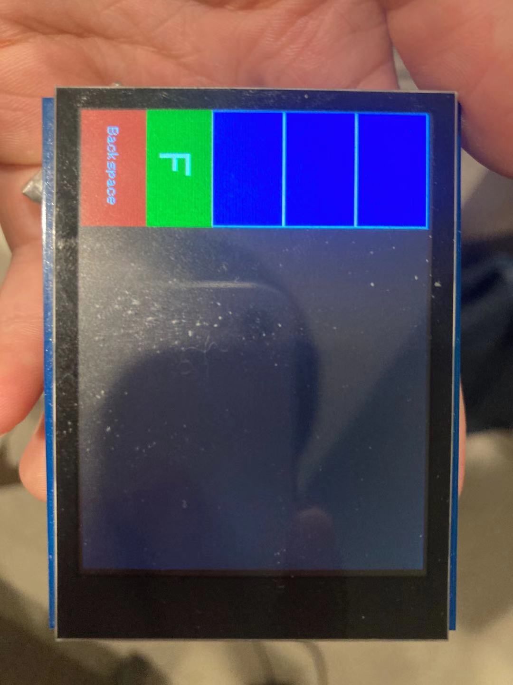
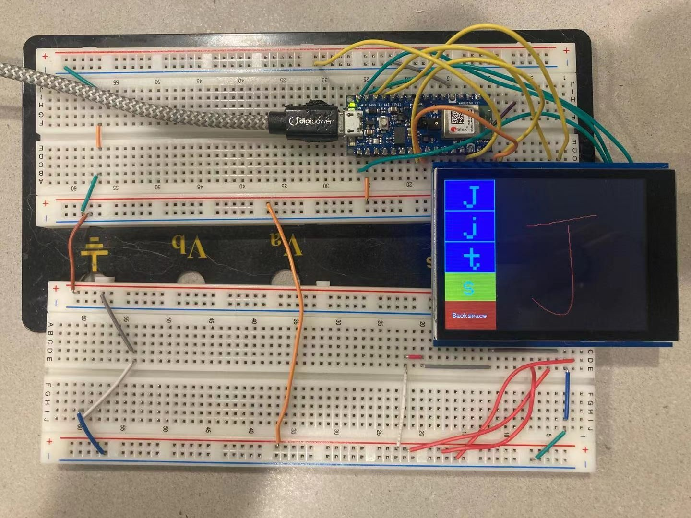
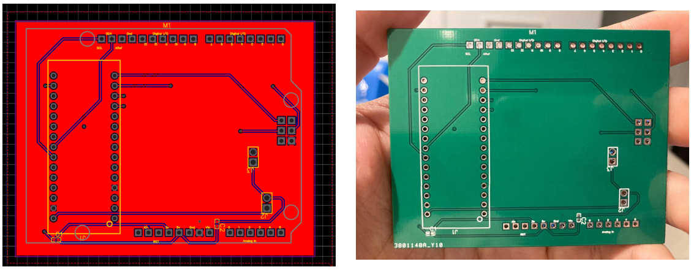
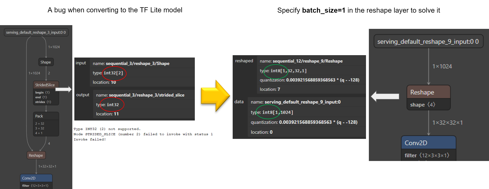
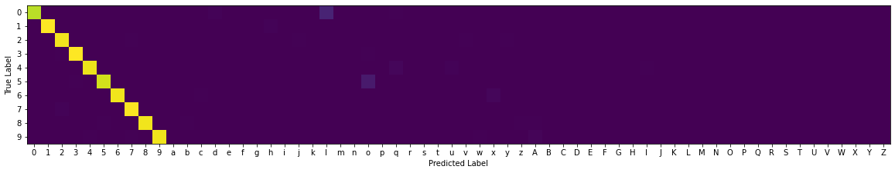
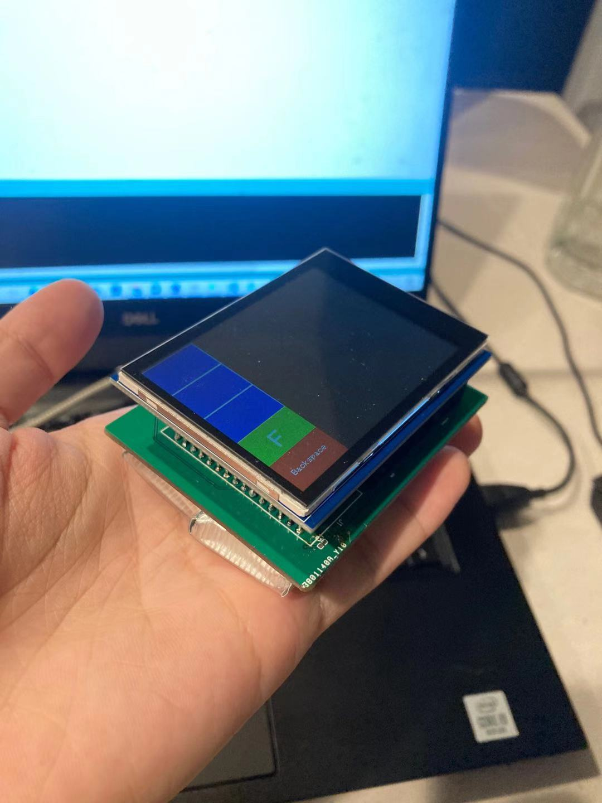

# Table of Contents
* Abstract
* [Introduction](#1-introduction)
* [Related Work](#2-related-work)
* [Technical Approach](#3-technical-approach)
* [Evaluation and Results](#4-evaluation-and-results)
* [Discussion and Conclusions](#5-discussion-and-conclusions)
* [References](#6-references)

# Abstract

Provide a brief overview of the project objectives, approach, and results.

# 1. Introduction

This section should cover the following items:

* Motivation & Objective: What are you trying to do and why? (plain English without jargon)
* State of the Art & Its Limitations: How is it done today, and what are the limits of current practice?
* Novelty & Rationale: What is new in your approach and why do you think it will be successful?
* Potential Impact: If the project is successful, what difference will it make, both technically and broadly?
* Challenges: What are the challenges and risks?
* Requirements for Success: What skills and resources are necessary to perform the project?
* Metrics of Success: What are metrics by which you would check for success?

# 2. Related Work

# 3. Technical Approach

## Operation Logic
The User Interface of the device is shown in figure 1. The black square area allows user to write/draw characters with fingers or stylus pen. The left panel is divided into 5 parts. The first 3 buttons on the top are the selection buttons used in slow mode. The 4th button from the top is used to switch between fast and slow mode. The red backspace button is used to delete text or clear screen without sending the keyboard stroke in slow mode. 

    

### Fast Mode 
In fast mode, after the user is done writing one character, the character with the highest score from inference is sent out through Bluetooth Low Energy immediately. Such setup allows maximum input speed.

### Slow Mode
In slow mode, the written character will not be sent out instantly after the inference is done. Rather, the characters with the top 3 scores from the inference will be printed in the blue panel, allowing users to confirm and select the correct character to send out as keyboard stroke. If none of the infered character matches user's input, the user can simply tap the 'backspace' button to clear the screen and rewrite the character. With such design, the input speed is slower in exchange for more robust inference.

    

## Bluetooth Low Energy
In contrast to Bluetooth classic, BLE is designed for significantly low power consumption, which is suitable for our application. Keyboard service is a reserved service in BLE, which eliminates the burden of writing custom service to send keyboar strokes. The infered character will be written as BLE characteristic to BLE keyboard service to achieve the wireless keyboard functionality.

## Image Resizing
The size of black canvas that records user's drawing is 240-by-240, which is 57.6k input parameters in total. Indeed, high-resolution image typically enables better prediction accuracy thorugh neural network. However, considering the computing resource provided by Arduino Nano 33 BLE Sense, it is necessary to reduce the model size to deploy the model to Arduino Nano 33 BLE Sense with real-time inference. Also, pixels are represented by truth values.

For fast resizing, we use box sampling to sum the pixel values in a box and skip the rest of the values once the sum is greater than 0. During tesing, we realized the recognition accuracy is affected by the thickness of strokes. Therefore, we artificially increase the stroke thickness by 3 times when performing downsizing. A comparison of writting on screen and the resized image is shown in figure 2 below.

    

## Printed Circuit Board Design
The system is first built on breadboard, shown in figure 3 below. After the basic functionality is verified, we ported the design to a 2-layer PCB to eliminate the jumper wires and improve mobility. We use easyEDA to PCB drawing for the ease of PCB ordering. The PCB drawing and finished PCB are shown in figure 4 and 5, respectively.

    

    

In our PCB design, 2 3.7V Lipo batteries are used as power source. 2 3.7V lipo batteries are placed in series to supply 7.4V voltage to Arduino Nano 33 BLE Sense. Our chosen touchscreen Adafruit ILI9341 has a built-in LDO and accepts input voltage from 2.7V to 5.5V. Since Arduino Nano 33 BLE Sense has a 3.3V pin, we decided to add 2 capacitor footprints where 1 footprint connects 3.3V to the input of touchscreen and the other one connects 3.7V (voltage of one of the battery) to test which supply voltage is more stable. 

## Firmware
The workflow of the firmware can be represented in the diagram below. There are two threads operating in parallel and 1 semaphore to help with the timing of two threads. One thread controls the operation of BLE, mainly the write characteristic command and the other thread controls the touchscreen as well as the inference of user's input. BLE thread releases the semaphore when it is done writing characteristic and touchscreen thread realses the semaphore when inference is done. 

    

Debouncing is cruicial for touchscreen applications. We allow 30ms between each touch on screen. When the user is drawing consective lines, we record the coordinate of start and end point and draw a straight line between these two points as the approximate trajectory. The straight line is estimated using Bresenham's algorithm. Doing so also alleviate the issue of insufficient SPI clock speed since the SPI clock speed is locked at 1 Mhz on Arduino Nano 33 BLE Sense. This issue has not been resolved. Reports of this issue can be found [here](https://forum.arduino.cc/t/nano-33-ble-spi-speed-not-changing/656881) and [here](hhttps://issueexplorer.com/issue/arduino/ArduinoCore-mbed/270).

Many characters are usually written in more than one consective stroke such as '4', 'B', and 'F'. To allow those characters to be captured, the firmware would wait for the next stroke for 150 ms before resizing and inference.

## 3D-printed Model for packaging

## Character recognition using Deep Learning

For the handwritten character recognition, the traditional method is to use OCR algorithms. However, for the Arduino Nano 33 BLE Sense we are using, most OCR algorithms require well over 1MB of flash space, and demand more computational capacity than a microcontroller can provide for real-time processing.

To develop real-time character recognition algorithms that can be used on microcontrollers, we use deep learning to build and train a model that can achieve about 85% accuracy on 0-9 and a-z handwritten characters. To make real-time processing possible on the Arduino Nano 33, we utilize a variety of  optimization skills to build a tiny convolutional neural network, which has only 50k parameters in total, and the inference time on the device is ~100ms.

### Dataset & Data Preprocessing

The dataset we used is Extended MNIST (EMNIST), which contains 814,255 characters in 62 classes. Compared to the MNIST dataset, it's about 12 times larger and includes a-z characters. Due to its huge scale, we didn't use other datasets to train the model.

We observed that there are four things that will cause a severe performance degradation in the real world related to the dataset: 

1. Handwritten characters have an arbitrary angle with respect to the touch screen. However, the dataset we used does not consider this situation.
2. Handwritten characters have an arbitrary size relative to the touch screen, but the training characters from the dataset all have the same size.
3. Handwritten characters have an arbitrary position relative to the touch screen, but the training characters in the dataset are all located in the center.
4. The strokes we obtain from the touch screen are a series of sampled points, which we then convert into a 1-bit character image for the deep learning model's input. But, the characters images in the dataset are all 8-bit grayscale. 

To address the issues listed above, as well as to improve the performance of the model in the real world, we make use of data augmentation. The preprocessing and augmentation sequence we used are:

1. Rescale the images to the float datatype of 0.0~1.0.
2. Randomly rotate the image within an angle from -15 degree to 15 degree. This is to solve the first problem mentioned above.
3. Randomly resize the original 28\*28 image to a new square image of size from 16\*16 to 34\*34. Therefore the training characters will have different size. This is to solve the second problem mentioned above.
4. Crop the resized image into a square image of size 32\*32 with random cropping positions. Thus, the training characters will be positioned at different position. This is to solve the third problem mentioned above.
5. Binarize image to 1-bit image. The threshold we use is 0.3. This will solve the final problem listed above.

The figures below are some examples of the original dataset images before pre-processing and augmentation.

The figures below are some examples of the training images after pre-processing and augmentation. Each figure is generated using one original image .

   
   &nbsp;&nbsp;&nbsp;&nbsp;
   
   &nbsp;&nbsp;&nbsp;&nbsp;
   

### Design Model Architecture
Due to the limitation of Arduino Nano 33 BLE, there are strict limitations on model architecture. The following requirements should be met for the success of this project:

1. Considering the target overall latency after the user finished writing a character is 150ms, the inference time should be equal or less than 120ms.
2. The layers available in Tensorflow Lite Micro are limited. Some common layers are not available, such as BatchNormalization layer.
3. The Arduino Nano 33 BLE has only 256 KB of SRAM. in addition, a large portion of the memory is needed to run the touch screen, generate input images, and send strokes using the BLE. So the available RAM space is limited.
4. The Arduino Nano 33 BLE has 1 MB of flash. Although this is still a small number compared to common neural networks, we didn't have any issue with flash space, since to meed the inference time requirement, the model is small enough.

The following is the model architecture we used: (right click to open a bigger view)

    

To achieve the best performance in a tiny model, I use multiple convolutional layer at the same level, and instead of using a big window size (e.g. 5 or 7) for the convolution layer, I set the window size of all convolutional layers to 3. It is a valuable conclusion from VGG that multiple 3x3 convolutional layers have better performance than one large convolutional layer,while also saving a lot of parameters. 

Another idea from recent research is that instead of using a flatten layer and 2 fully connected layers at the top of the network, I use one GlobalAveragePooling layer and an output FC layer. This setting has the best performance and can save a lot of parameters. I also tried FC+FC, GlobalMaxPooling+FC and GlobalMaxPooling alone, but GlobalAveragePooling+FC is the best.

We have tried many activation functions, such as ReLU, PReLU, ELU and other variants. However, PReLU, ELU and other variations cannot beat ReLU in our project.

The final model architecture has 11,160 parameters in total. The accuracy on the training set is 81.59% and on the test set is 83.64%.

### Implementation & Optimization

We use Tensorflow to implement and train the model and then use Tensorflow Lite Micro to quantize and convert the model to C header file.

There are many techniques to optimize the model for edge computing devices, such as quantization, quantization aware training, pruning, and so on. 

We have tried quantization aware training but did not observe any performance improvement. Similarly, we didn not use pruning because the current version of Tensorflow Lite Micro will not benefit from pruning, i.e., the latency will not decrease.

For the quantization part, we quantize not only the weights and biases but also the input and output of the model. Both are quantized to 8-bit.

When quantizing and converting the model, we face a bug in Tensorflow Lite Micro, which is that the reshape layer cannot be quantized correctly. More specifically, the output of the reshape layer will be 32-bit integer datatype, which is not supported by Arduino Tensorflow Lite Micro. A illustration of the bug is shown below.

    

The bug is reported in this [github page](https://github.com/tensorflow/tensorflow/issues/45256) and this [github page](https://github.com/tensorflow/tensorflow/issues/50286), but we haven't see any official solution until the latest Tensorflow release.

We spent a lot of time on this and found a perfect solution, as the image shown above. In the training stage, we use normal setting for the reshape layer, i.e., batch_size=32 or 64. In the converting stage, we create a new model with the same architecture, but set the batch_size of the reshaping layer to 1, and transfer the weights and biases to the new model. Finally, we convert the new model to C header file.

This perfectly solves the bug, without any loss of performance during training on the GPU and inference on the board.

# 4. Evaluation and Results
## 4.1 Evaluation on the Test Set

We evaluate the model on two datasets: EMNIST and MNIST.

For the MNIST dataset, we achieved a test accuracy of 95.38%. Considering the model is trained on the EMNIST dataset, we can say that the model has good generalization capability. The confusion matrix is shown below.

    

For the EMNIST dataset, we achieved a test accuracy of 83.71%. Considering the 83.64% evaluation accuracy during training, quantization does not bring performance degradation. The confusion matrix is shown below.

    

A detailed analysis of the confusion matrix is shown in the[Discussion](#limitation--error-analysis) section.

## 4.2 Real world evaluation
After the system is migrate from breadboard to PCB, 2 demonstrations are made for fast mode and slow mode. Refer to the links below.

Demo Video for Fast Mode:
Demo Video for Slow Mode:

For evaluations, the system is tested with 2 3.7V LiPo battery as the power source shown in figure 4 below. Then, the recognition latency and recognition accuracy are tested. The recognition accuracy is tested under fast mode and slow mode separately. In the test for slow mode, we count the trial as success if the written character shows up as 1 of the 3 selections on the left panel. In the test for fast mode, when calculating accuracy, only if the highest scoring character in the output matches the input is considered successful. In testing for accuracy, we handwrite each character (0 to 9, a to z, and A to Z) for 5 times and calculate the average accuracy over all characters. The accuracy for fast mode is 80.6% and the accuracy for slow mode is 95.4%. 

Refer to the following excel files for detailed testing results:

[Fast Mode](https://github.com/hlc1209/ecem202a_project/blob/main/data/testing_fast_mode.xlsx)
[Slow Mode](https://github.com/hlc1209/ecem202a_project/blob/main/data/testing_slow_mode.xlsx)

    

# 5. Discussion and Conclusions

## Error Analysis 
Due to the limitation of the performance of the Arduino Nano 33 BLE, as well as the size of the available touchscreen, we choose to allow only one character on the screen at a time, rather than writing a whole sentence. 

This compromise is not only for the convenience of the user, but also for the efficiency of the system. However, it also brings harmful effects to the recognition accuracy. As we can see in the confusion matrix shown below, there are some obvious errors.

    

The errors in the red circle are due to the fact that it is almost impossible to distinguish the upper and lower case letters when only giving a single character without context. For example, the pair 'x' and 'X', the pair 'o' and 'O', the pair 'z' and 'Z', and the pair 's' and 'S'. 

A simple method to deal with this problem is to always output the lower case letters, since the situation that the upper case letters are written is very rare.

Other errors on the left of the circle are due to the similarity between numbers and letters. For example, the pair '0' and 'O', the pair '1' and 'l', the pair '2' and 'Z', and the pair '3' and 'S'. 

It is almost impossible to deal with these errors as long as we only allow one character each time on the screen. Allowing more characters on the screen, or deploying a time-series deep learning model, is not a good idea for this microcontroller.

Fortunately, we developed the slow mode that allows the user to choose top 3 characters. The accuracy of the system is improved to 95.4% in the slow mode and in most cases, the user can get the correct character without having to write it again.

## Future Work

# 6. References
